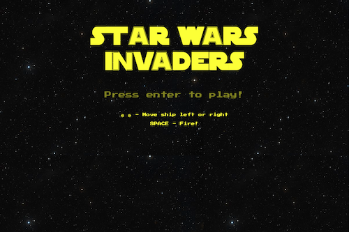
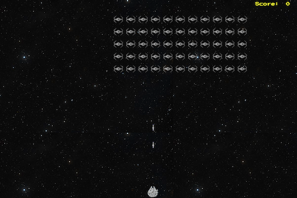

# GA Software Engineering Immersive: Project 1

First project: Star Wars themed Space Invaders browser game built with Vanilla Javascript.

# Star Wars Invaders

Space Invaders is a Japanese shooting video game released in 1978 by Taito. It was developed by Tomohiro Nishikado, who was inspired by other media: Breakout, The War of the Worlds, and Star Wars. This game, in turn, is star wars themed, paying homage to this classic game.

500x333

## Technologies Used

1. HTML5
2. CSS
3. Javascript

## Getting Started

The game is deployed on GitHub Pages and it can be found here: LINK WILL GO HERE

## Installation

Installation steps will go here

## Features

Game features will go here

## Game Architecture / Challenges

Game architecture & challenges will go here

## Next Steps

Planned future enhancements (icebox items) will go here
