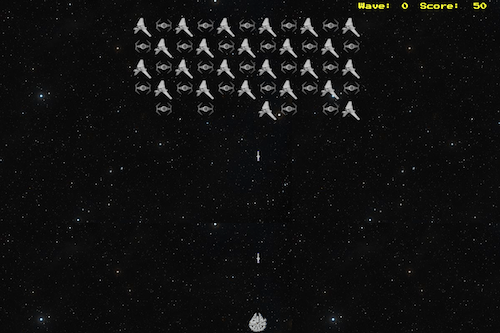

# GA Software Engineering Immersive: Project 1

First project: Star Wars themed Space Invaders browser game built with Vanilla Javascript (Canvas graphics not allowed)

# Star Wars Invaders

Space Invaders is a Japanese shooting video game released in 1978 by Taito. It was developed by Tomohiro Nishikado, who was inspired by other media: Breakout, The War of the Worlds, and Star Wars. This game, in turn, was built with a Star Wars theme, paying homage to the original classic.

## Technologies Used

## Getting Started

This browser based game (no installation needed) is deployed on GitHub Pages and it can be found here: https://mdinizreis.github.io/star-wars-invaders/

How to play:

     ← →  - Move ship
    SPACE - Fire!

## Features

- Game screen is 1200x800 and is NOT resizable
- Player can choose their ship (Millenium Falcon or X-wing) at initial screen
- Background music and sound effects (start, shoot, game over) kick off as the game starts (press ENTER at initial screen)
- Player can move their ship left or right (← → arrows) and shoot bullets (Spacebar).
- Rate of bullets fired is limited to 2 bullets per second
- When all enemies in a grid get killed they respawn and get progressively harder (faster) at each new wave
- Each enemy killed adds to the player score and faster/harder enemies (newer waves) grant more points per enemy killed
- Top 5 high scores are stored on browser local storage and displayed at initial screen.
- Player name (for High Scores table) is requested at Game Over only if they have made it to the top 5 High Scores
- Player loses when an enemy reaches the bottom of the game screen
- Like the original arcade, the game has no real finale, winning is having the highest score possible in the High Score Table and remaining #1

## Game Architecture / Challenges

All HTML elements are created during run time (except for the game-container div that is the only element pre established in the HTML).

The game architecture revolves around a few main technical pieces:

### Initial screen creation with High Score Table

- Initialization fuction calls the Event Listener (createEventListener()) and Initial Screen (createInitialScreen()) creation functions
- createInitialScreen() manipulates the DOM to create all Initial screen HTML elements within the game container. Also calls displayHighScores() to create the High Scores table HTML elements using the data from getHighScores() to populate it
- createEventListener() captures player keystrokes (left, right, ENTER and SPACEBAR) to perform appropriate actions or functions. At initial screen left and right keys are used for 'ship selection' but as the game starts it is used to move the ship
- When ENTER key is hit a series of functions (detailed in the section below) are called to initiate the game, including the removing all initial screen HTML elements from the DOM

### Creating and positioning player, score and enemies

After player press ENTER at initial screen a few functions come at play:

- createScore(): creates and positions HTML elements for the in-game Score and Waves counters
- createPlayer(): creates player ship selecting corresponding CSS ID based on player ship selection at initial Screen. Player is positioned (CSS property) centralized at the bottom of the game container by default
- createEnemyGrid(): simple FOR loop that calls createEnemy() until the maximum number of enemies set is reached (right now is 55, just like the original Space Invaders arcade)
- createEnemy(): creates each enemy HTML element on the DOM alternating between 2 enemy CSS ids (different enemy images for visual effect) and updates the array of enemies. Calls positionEnemy() for each enemy created
- positionEnemy(): this funtion calculates the number of rows and columns (each row is set for 11 enemies max, like original game), calculates the position on the X and Y axis and updates the left and top properties of each enemy accordingly
- moveEnemies(): more below

### Moving Enemies

- moveEnemies() start keeping track of the **leftmost (firstEnemyX) and rightmost (lastEnemyX)** on the x-coordinate of the enemies, as they will be used to calculate when the grid reached the left and right edges of the game container, to initiate the next movement.
- for each enemy on the enemies array, update the leftmost and rightmost enemy tracker and initiate the movement logic, using a set of variables (moveRight,moveDown,moveLeft,moveDownAgain, enemyReachedEdge and enemyReachedBottom) to control movement direction
  - updates the left and top property of each enemy in CSS, considering the current number of waves to increase the speed of movement (enemies get progressively faster/harder at each wave)

- if an enemy reaches the the bottom edge (enemyReachedBottom), calls gameOver()
- requestAnimationFrame() method use moveEnemies() as the callback function so enemies keep moving

### Creating and moving Bullets

- If the game has started (past game Initial Screen), shootBullet() is called when player press the spacebar
- canShoot variable is used to limit fire rate using setTimeout() method. If canShoot is true the function will:
  - play shootAudio()
  - create bullet HTML elements on the DOM
  - update bullets array
  - call positionBullet()
- positionBullet() gets player current position using getBoundingClientRect() method, position the created bullet relative to it and pass it as argument to moveBullet()
- moveBullet() moves bullet upwards on the Y axis until it reaches the top edge of the game container, when it removes the element from the DOM and removes bullet from the bullets array
- requestAnimationFrame() method uses moveBullet() as the callback function so bullets keep moving
- moveBullet() calls checkCollision() during each move of the bullet to verify collision with enemies

### Check collision and execute corresponding actions

- checkCollision() gets bullet current position using getBoundingClientRect() method and compares it to the position (left, right, top, bottom properties) of each enemy on the array of enemies:

- If a collision with an enemy is detected it removes the bullet and enemy from the DOM and updates the bullets and enemies array, calling incrementScore() to update player score
- If the enemies array gets empty (meaning player killed all enemies) calls the createEnemyGrid() again to create a new enemies grid, while updating wave counter (incrementWave())

### Creating and maintaing in game Score and High Scores table

- incrementScore() is called everytime there is a bullet collision with and enemy, adding points to the player score
  - Score counter consider the current player wave to calculate how many points to add, as enemies get faster/harder at each wave and warrant more points per kill
- incrementWave() is called everytime a new grid of enemies is respawn
- saveHighScore() is called by gameOver() and simply gets the current scores from the browser local storage, add current score to highScores array, sort it (descending order) and update it to ensure it keeps only the top 5 scores, before updating the local storage again.

### Game Over actions

- GameOver() is called when enemy reaches the game container bottom edge and:
  - play gameOverAudio
  - Get current top 5 high scores, compare 5th high score with player current score and ask for player name only if current score is higher
  - pass current score to saveHighScore()
- calls reinit() that will:
  - call destroy(): cleans all HTML elements within the game container, remove event listeners, clean enemies array and clean bullets array
  - call init() function to restart the Initial Screen and Event Listeners

## Some Interesting stuff...

- Used Special Fonts for better game graphic appearance
- Using window.localStorage property to getItem and setItem on browser local storage for maintaining High Scores
- Using audio for background music and sound fx corresponding to actions
- getBoundingClientRect() method that returns a DOMRect object providing information about the size of an element and its position relative to the viewport
- window.requestAnimationFrame() method tells the browser you wish to perform an animation requesting the browser to call a callback function before the next repaint
- Event:preventDefault() method was used to avoid scrolling down the screen when pressing spacebar (default action on browser)

## Next Steps

Implement:

- Enemies and player collision and actions
- Enemies can shoot back
- Player has '3 lives'
- Special bullets and abilities depending on selected ship at initial screen
- Enemy 'mystery ship' that grants more points if killed
- Create base Shelter / Shield that detiorates on collision from enemy fire
